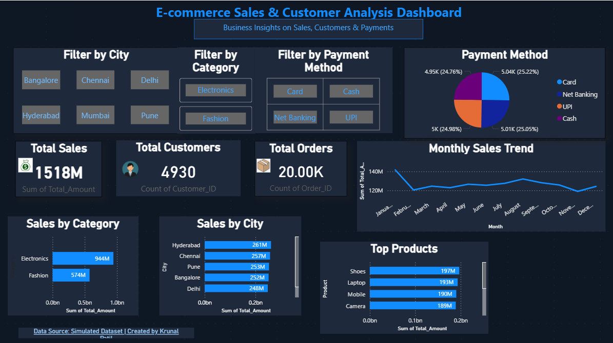

# 📊 E-commerce Sales & Customer Analysis Dashboard

🚀 Built using Excel, SQL, and Power BI to analyze sales performance, customer behavior, and payment trends.

---

## 🔹 Project Overview

This project focuses on analyzing e-commerce sales data to understand business performance, customer behavior, and payment trends. The dashboard provides meaningful insights that can help in better decision-making.

---

## 🔧 Tools Used

* Microsoft Excel (Data Cleaning & Preparation)
* SQL / MySQL (Data Analysis using queries)
* Power BI (Data Visualization & Dashboard)

---

## 📈 Key Features

* KPI Cards for Total Sales, Total Orders, and Total Customers
* Sales Analysis by Category and City
* Monthly Sales Trend Visualization
* Top Performing Products
* Payment Method Distribution
* Interactive Filters (City, Category, Payment Method)

---

## 🖼️ Dashboard Preview

---

## 💡 Key Insights

* Electronics category generated the highest revenue
* Major contribution comes from metro cities
* Sales trends vary across months indicating seasonal patterns
* UPI and Card are the most commonly used payment methods

---

## 📁 Project Structure

Ecommerce-Sales-Analysis-Dashboard/
│
├── Ecommerce_Dashboard.pbix
├── README.md
│
├── dataset/
│   ├── orders.csv
│   ├── customers.csv
│   └── payments.csv
│
└── images/
└── dashboard.png

---

## 🔹 Project Preview

Power BI dashboard file (.pbix) is included in this repository.

---

## Author

**Krunal Patil**

MCA Graduate | Aspiring Data Analyst

### Skills
SQL | Power BI | Excel | Python | Data Visualization | Data Analytics | Machine Learning

### Connect With Me

📧 Email: pkrunalpatil26@gmail.com

💼 LinkedIn: https://linkedin.com/in/krunal-patil-ab10172b9

💻 GitHub: https://github.com/Krunalpatil15

I am passionate about transforming raw data into meaningful insights through analytics, visualization, and business intelligence.
